<details>
<summary>React 특강</summary>

---

`//@ts-nocheck` : TypeScript 오류 미검출

## package.json

```
  "scripts": {
    "dev": "pnpm watch | pnpm serve",
    "serve": "live-server --host=localhost --port=3000 --no-browser",
    "compile": "tsc -p tsconfig.json",
    "watch": "pnpm compile --watch"
  },
```

## tsconfig.json

```
tsc --init
```

위 명령어 실행 시 Default 상태로 생성

```
{
  "compilerOptions": {
    "baseUrl": ".",
    "outDir": "scripts",
    "target": "ES2017",
    "module": "ESNext",
    "esModuleInterop": true,
    "forceConsistentCasingInFileNames": true,
    "strict": true,
    "skipLibCheck": true
  },
  "include": ["src/**/*.ts"],
  "exclude": ["node_modules", "scripts", "dist"]
}
```

## TypeScript : Type 추론 가능

## Interface

```
interface Options {
  // required
  option1: number;
  // optional
  option2?: boolean;
}
```

- interface 내의 요소들은 기본적으로 required
- 변수명 뒤에 ? 를 붙여 optional 속성으로 작성 가능

또는

```
interface Options {
  // required
  option1: number;
  // required
  option2: boolean;
}

const defaultOptions: Partial<Options> = {
  option1: 0
}
```

- Partial<인터페이스> 적용 시 인터페이스 내 옵션들이 전부 optional

## Routing

- 리액트 라우터 설치

```
$ npm install react-router-dom
```

- 프로젝트에 라우터 적용

```
import React from 'react';
import ReactDOM from 'react-dom';
import './index.css';
import App from './App';
import { BrowserRouter } from 'react-router-dom';

ReactDOM.render(
  <BrowserRouter>
    <App />
  </BrowserRouter>,
  document.getElementById('root')
);
```

- 컴포넌트 만들기

```
src/pages/Home.js

import { Link } from 'react-router-dom';

const Home = () => {
  return (
    <div>
      <h1>Home</h1>
      <Link to="/about">About</Link>
    </div>
  );
};

export default Home;
```

```
src/pages/About.js

const About = () => {
  return (
    <div>
      <h1>About</h1>
    </div>
  );
};

export default About;
```

```
src/App.js

import { Route, Routes } from 'react-router-dom';
import About from './pages/About';
import Home from './pages/Home';

const App = () => {
  return (
    <Routes>
      <Route path="/" element={<Home />} />
      <Route path="/about" element={<About />} />
    </Routes>
  );
};

export default App;
```

## Route

```
<Routes>
  <Route path="/" element={<Home />} />
  <Route path="/about" element={<About />} />
</Routes>
```

Vue의 `router/index.js` 에 Route 구조를 적용한 후 사용한 것과 비슷하게
React의 경우 App.js에 Route 구조를 지정하고 사용하는 것이 일반적인 흐름

```
<Routes>
  <Route path="/" element={<Home />} />
  <Route path="/articles" element={<Articles />}>
    <Route path=":id" element={<Article />} />
  </Route>
</Routes>
```

위와 같은 중첩 형태도 구현 가능

</details>

<details>
<summary>Nomadcoders-React</summary>

---

JavaScript는 strongly-typed 언어가 아님

TypeScript는 JavaScript에 안전장치를 추가한 strongly-typed 언어

기존에 리액트 프로젝트에 타입스크립트를 추가하기

1. npm install --save typescript @types/node @types/react @types/react-dom @types/jest
2. src 폴더 안에 있던 App.js와 index.js 파일을 App.tsx와 index.tsx 로 바꾼다.
3. "npx tsc --init" 명령어로 tsconfig.json 파일 생성한 후, tsconfig.json 파일에 "jsx": "react-jsx"추가

---

{
"compilerOptions": {
......
"jsx": "react-jsx"
}
}

---

4. src/index.tsx에서 수정

---

import ReactDOM from "react-dom/client"

## const root = ReactDOM.createRoot(document.getElementById("root") as HTMLElement);

5. npm i --save-dev @types/styled-components

### DefinitelyTyped

https://github.com/DefinitelyTyped/DefinitelyTyped

- TypeScript 작업 시 대부분의 필요한 type definition들을 얻을 수 있음

## TypeScript

```
useState<type1 | type2>()
```

위처럼 Type을 세팅하여 State의 Type을 여러가지로 세팅도 가능하다

# React-Router

### errorElement

문제 발생 시 해당하는 Component를 화면에 보여줄 수 있다.

이를 Child Component에도 추가하여 해당 Component에서 발생한 문제에 대해 다른 컴포넌트들을 보호할 수 있다.

### useNavigate

Vue 에서의 location.push 와 비슷한 기능

함수를 통해서 특정 event 발생 시 페이지를 이동시킬 수 있다.

</details>

<details>
<summary>'t cha Project</summary>

---

컴포넌트 다이어그램
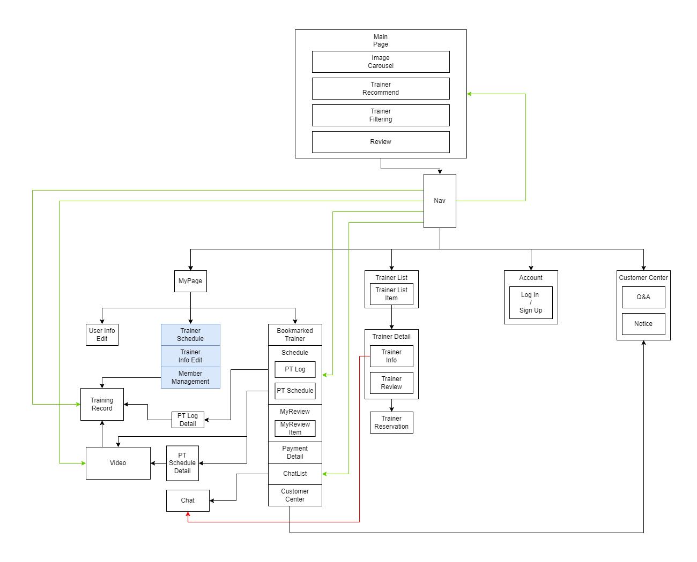

---

### 프로토타이핑 (목업)

- Home

  

<details>
<summary>나머지 페이지</summary>

- Navber

  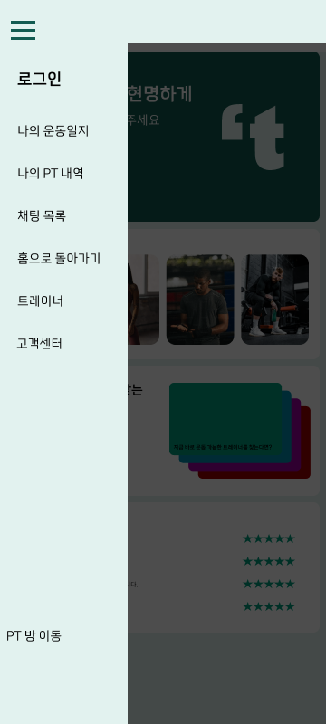

- Trainer List

  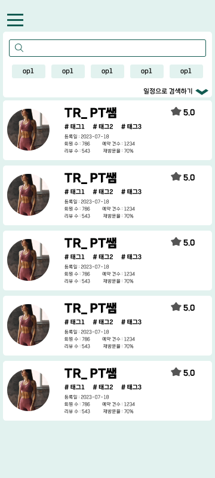

- Trainer List (날짜 선택하여 필터링)

  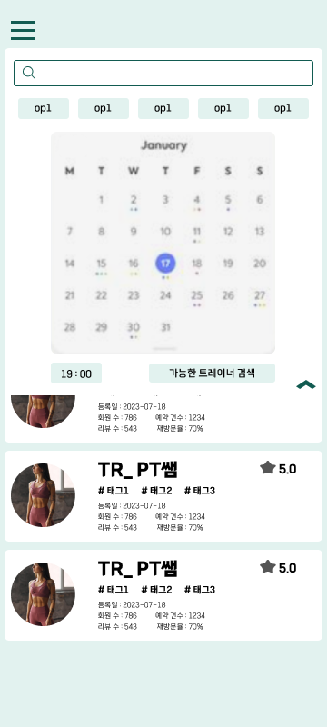

- Trainer Detail (Info)

  .png>)

- Trainer Detail (Review)

  .png>)

- User MyPage

  

- User Info Edit Page

  

- Bookmarked Trainer

  

- User Schedule

  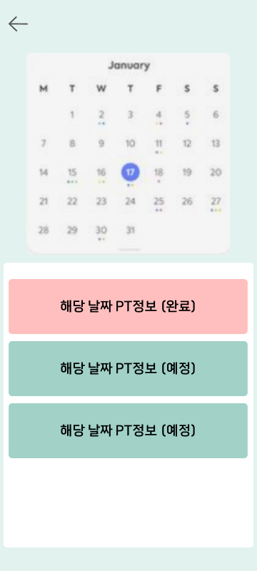

- My Review

  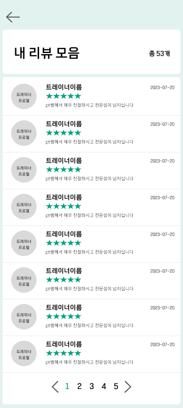

- Chat List

  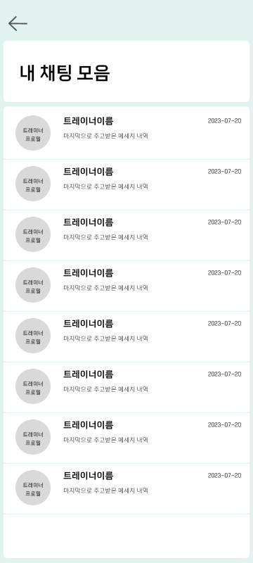

- Trainer MyPage

  

- Trainer Info Edit

  

- Trainer Schedule

  

- Auth

  

- PT Room (Mobile Web)

  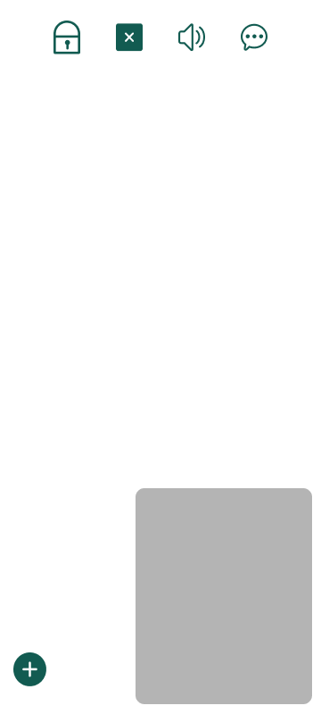

- PT Room (Mobile Web)

  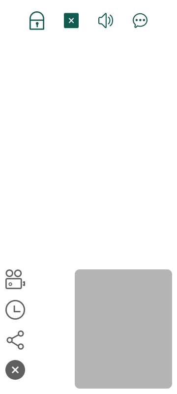

- PT Room (PC Web)

  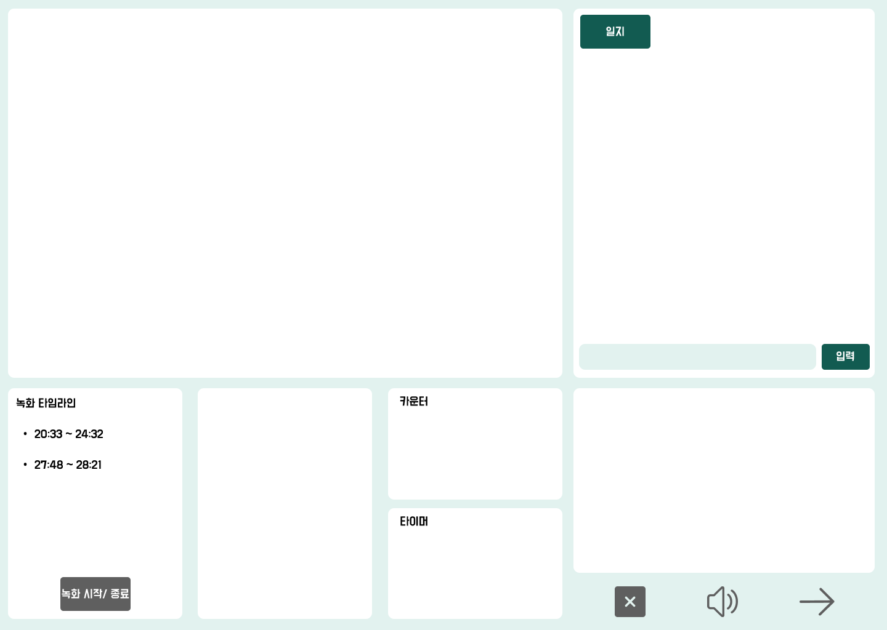

- 고객센터 (공지사항)

  .png>)

- 고객센터 (Q&A)

  .png>)

  </details>

## Project 공통 적용사항

기본 컬러 및 컨셉

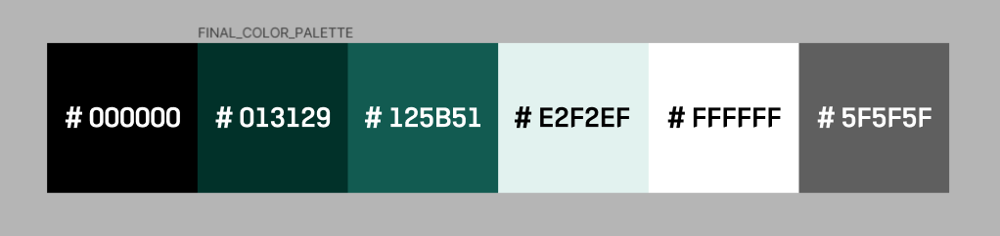

## 써드파티 라이브러리 선택 고민

전역 상태 관리 라이브러리를 선택하는데에 있어 고민을 했다.

### Redux와 Recoil의 차이점 정리


- Redux

  - 먼저 나온 상태 관리 라이브러리
  - 중앙 집중식 Storage와 상태 업데이트를 위한 Reducer를 사용
  - 단방향 데이터 흐름
  - React 메인 개발자인 Dan이 유지보수를 진행하고 있음

  - 장점

    - 오래된 역사, 탄탄한 커뮤니티 (대중적)
    - 미들웨어를 활용한 여러 비동기, 로그 작업 등의 처리
    - 단방향 데이터 흐름을 따르기에, Reducer 등의 단위 테스트가 비교적 쉽다

  - 단점

    - 구조가 너무 복잡하다
      - 간단한 웹앱을 만들 때에도 Action, Reducer, Action Creator 등의 코드를 모두 작성해야한다
    - State가 변경될 때 Component를 업데이트 해주는 반응형 메커니즘이 기본적으로 탑재되지 않아, React의 자체 메커니즘을 활용하거나 추가 외부 라이브러리 사용이 필요함

- Recoil

  - 비교적 최근에 나온 상태 관리 라이브러리
  - Facebook사에서 개발, 가장 React스러운 상태관리라는 철학
  - Recoil의 경우 Next.js와 조금 더 친숙한 편이기도 함

    

- 장점

  - 간단한 구조
  - 작은 프로젝트를 시작하는데 큰 보일러 플레이트가 필요하지 않다
  - Component가 렌더링되는 시기, 상태 등을 세밀하게 제어할 수 있다
    - 이를 통해 성능 최적화 등에도 사용 가능
  - 동적인 기능 구현에 유리

- 단점

  - 사용자 커뮤니티가 비교적 빈약
  - 시작은 쉬울 수 있으나, Recoil의 상태관리 자체가 세분화 되어있어 디버깅 또는 테스트에 어려움을 느낄 수 있다

---

### Redux와 비교했을 때 Recoil의 이점

- Redux의 복잡한 코드
  Redux 를 사용하고자 할 때 마주하는 가장 큰 어려움은 복잡한 코드다. Redux 를 활용하기 위해서는 action, dispatcher, reducer, store 등 구현해야 할 기본 코드 들이 큰 편이다. 이는 보일러 플레이트를 활용해서 해결할 수 있는 문제지만, 만약 여러 개발자가 공동 작업 할 때 컨벤션을 적용하지 않고 코드를 작성할 경우 자기만 알아볼 수 있는 구조의 코드를 작성하게 된다.

- 간단한 Recoil 의 개념
  Redux 를 이해하고 사용하려면 공부해야 할 것들이 많다. 데이터의 흐름을 추상화 하여서 익히려고 하여도 여러가지 복잡한 흐름을 이해하는 건 쉽지 않다. 이에 반해서 Recoil 에서 state 를 관리하는 방법은 굉장히 간단해 보인다.

- 쉽게 사용하는 비동기 로직
  Redux 에서 비동기를 활용하기 위해서는 middleware 을 활용한다. 비동기 통신을 한다면 통신의 결과가 Success 일수도 있고 Fail 일 수도 있다. 이를 구분하여 state 관리를 해야하는데, 이를 쉽게 하기 위해서 Redux 에서는 Redux-thunk 혹은 Redux-saga 같은 미들웨어를 활용한다. 하지만 Recoil 에서는 내장된 개념인 selector 을 활용해 추가적인 미들웨어의 사용 없이 쉽게 비동기 로직을 구현할 수 있다.

---

참고

- https://velog.io/@duroomi/%EB%9D%BC%EC%9D%B4%EB%B8%8C%EB%9F%AC%EB%A6%AC-Recoil-vs-Redux

- https://blog.toktokhan.dev/react-%EC%83%81%ED%83%9C%EA%B4%80%EB%A6%AC-%EC%B5%9C%EA%B0%95%EC%9E%90%EB%8A%94-f0753ad7d186

추가

React-Query 관련 글

- https://tech.kakaopay.com/post/react-query-1/

### 결론

```
위 내용처럼 다양한 정보들을 찾아보았지만, 글로는 대부분 이해해도 크게 와닿지 않는다는 느낌이 많이 들어 "요즘 이걸 많이 쓰니 쓰자" 와 같은 이유로 선택하기보단 각 Tool들의 장단점을 확인하고 내 프로젝트에 어울리는 Tool을 선택하는 것이 맞다는 생각이 들었다.

일단 오래 쓰여왔으며, 대중적이고, 개발자 풀이 크게 형성되어 있는 Redux를 공부하며 장단점을 스스로 느껴보고, 지속적으로 어떤 프로젝트나 상황에 어떤 라이브러리가 용이할지에 대해 스스로 판단할 수 있는 실력을 기르는 것이 중요하다고 생각되었다.
```

</details>
